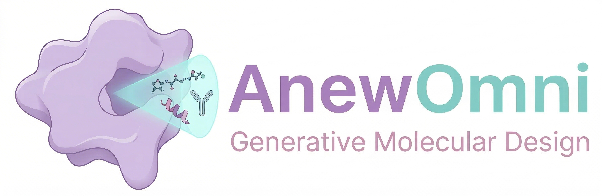
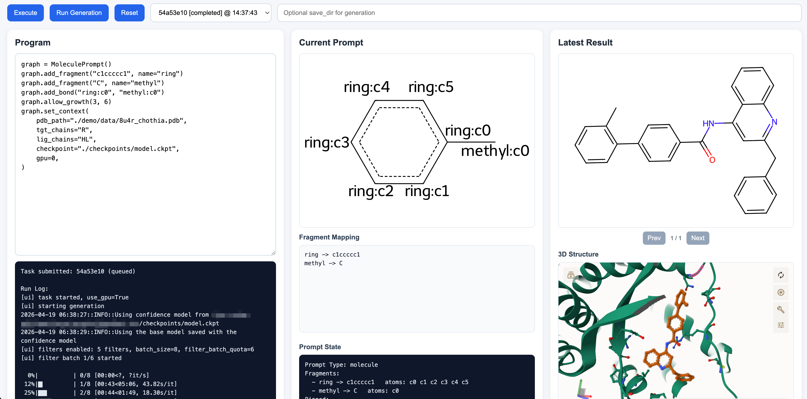

<div align="center">
  <div>&nbsp;</div>
  
</div>


<div align="center">

:fire: [Web Server](https://anewbt-mind.healthybaike.com/) | :page_facing_up: [Paper](https://www.biorxiv.org/content/10.64898/2026.03.12.711044)
</div>


# :mag: Quick Links

- [Installation](#rocket-installation)
  - [Environment](#environment)
  - [Model Checkpoints](#model-checkpoints)
- [Usage](#eyes-usage)
  - [Run](#run)
  - [Demo](#demo)
  - [Interactive UI](#interactive-ui)
- [Citations](#citations)
- [License](#license)
- [Contact Us](#contact-us)

# :rocket: Installation

## Environment

We provide the environment configurations for **cuda 12.4 + pytorch 2.5.1** (`env_cuda124.yaml`), which can be installed by the following command using `conda`:

```bash
conda update conda  # prevent conda from stucking in "resolving environment"
conda env create -f ./env_cuda124.yaml
```

After installation, please activate the environment by the following command:

```bash
conda activate AnewOmni
```

### Cofolding Models (Optional)

> This section is optional and is only required if you want to run the de novo antibody/nanobody design pipeline (design + structure prediction).

For backend-specific (e.g. protenix, boltz2) setup instructions, please see [docs/antibody-pipeline.md](docs/antibody-pipeline.md). Please also keep these backend environments separate from the main AnewOmni environment.


## Model Checkpoints

The trained model checkpoint (`model.ckpt`) is provided at [github release](https://github.com/bytedance/AnewOmni/releases/tag/init). Please download it into the `checkpoints` folder.

```bash
cd checkpoints
wget https://github.com/bytedance/AnewOmni/releases/download/init/model.ckpt
```

# :eyes: Usage

## Run

### General Entry Point

We provide a universal entry point to run inference on different binder modalities by specifying the configuration (`.yaml`) and the output folder as follows:

```bash
python -m api.generate_with_rank --config /path/to/config.yaml --save_dir /path/for/output
```

The example of a `config.yaml` is as below:

```yaml
dataset:
  # Multiple references can be provided. You just need to add the corresponding information in a new line under each of pdb_paths, tgt_chains, and lig_chains.
  pdb_paths:
    - ./demo/data/8u4r_chothia.pdb   # Path to the reference complex. Both pdb files and mmcif files are supported
  tgt_chains:
    - R     # The target proteins only include one chain, that is R.
  lig_chains:
    - HL    # The reference binder, which is an antibody, includes two chains, H and L. For antibody cdr design, the program assumes the heavy chain goes before the light chain, which means it will regard H as the heavy chain and L as the light chain in this case.

templates:
  # Here we specify the type of binders we want to design
  - class: LinearPeptide    # Linear peptides with at lengths between 10 to 12, left inclusive and right exclusive.
    size_min: 10
    size_max: 12
  - class: Molecule     # Small molecules. By default the number of blocks is sampled according to the spatial size of the binding site. You can also specify "size_min" and/or "size_max" to control the threshold of the sampled number of blocks.

batch_size: 8   # Batch size. Adjust it according to your GPU memory available. Batch size = 8 can be run under 12G memory for most cases.
n_samples: 20  # Number of generations. On each target provided, the model will generate 20 candidates for each template.
patience: 100  # the generation stops if 100 samples are generated yet the top-k have not changed
```

Ideally, you can include a reference binder (such as the native protein-protein interaction partner) in the provided structure file. In this case, the algorithm will choose the residues within 10 $\text{\AA}$ distance to the reference binder as the binding site. Otherwise, you can manually specify some residues on the target protein to specify the binding site. The algorithm will choose the residues neighboring your specified hotspots as the binding site. Here is the example:

```yaml
dataset:
  pdb_paths:
    - ./demo/data/8u4r_chothia.pdb
  tgt_chains:
    - R
  hotspots:
    - [[R, 188, ''], [R, 288, ''], [R, 192, ''], [R, 196, '']] # each hotspot is represented as [chain id, residue number, insertion code]
```

We have also provided demo configurations for common binder modalities in the Demo section.

### De Novo Antibody Pipeline

The de novo antibody/nanobody design pipeline uses a separate entry point. Here is a demo command:

```bash
python -m api.tools.ab_design \
  --config ./demo/antibody_pipeline.yaml \
  --save_dir ./output
```

By default, the pipeline uses `protenix` as the cofold backend. For CLI arguments, cofold backend configuration, and the YAML schema supported by the antibody pipeline, please see [docs/antibody-pipeline.md](docs/antibody-pipeline.md).

## Demo

| Binder Modality | Template Class | Configuration | Description |
|:----|:--|:--|:--|
| Small Molecule | `Molecule` | `demo/small_molecule.yaml` | The range of number of blocks can be either specified or automatically sampled based on the spatial volume of the binding site. |
| Linear Peptide | `LinearPeptide` | `demo/linear_pep.yaml` | Minimum and maximum of lengths need to be specified. |
| Disulfide Cyclic Peptide | `DiSulfidePeptide` | `demo/disulfide_cyc_pep.yaml` | Prompting generations with cysteines at head and tail, as well as a disulfide bond between them. |
| Head-to-Tail Cyclic Peptide | `HeadTailPeptide` | `demo/headtail_cyc_pep.yaml` | Prompting generations with amide bond between head and tail. |
| Antibody Single CDR | `AntibodySingleCDR` | `demo/antibody_single_cdr.yaml` | Antibody frameworks should be provided with *Chothia* numbering system, and the CDR type to be designed need to be specified. |
| Antibody Multiple CDRs | `AntibodyMultipleCDR` | `demo/antibody_multiple_cdrs.yaml` | Antibody frameworks should be provided with *Chothia* numbering system, and the CDR type to be designed need to be specified. Change of the CDR lengths is also supported. |

**Arguments**

`Molecule`:
  - `size_min` (default: `None`): Minimum number of blocks in the generated small molecule.
  - `size_max` (default: `None`): Maximum number of blocks in the generated small molecule.

`LinearPeptide`:
  - `size_min` ($\geq 4$, default: 8): Minimum number of residues in the generated peptide, inclusive of this value.
  - `size_max` ($\leq 25$, default: 13): Maximum number of residues in the generated peptide, exclusive of this value.

`DiSulfidePeptide` and `HeadTailPeptide`:
  - `size_min` ($\geq 4$, default: 8): Minimum number of residues in the generated peptide, inclusive of this value.
  - `size_max` ($\leq 25$, default: 13): Maximum number of residues in the generated peptide, exclusive of this value.
  - `w` (default: 1.0): Strength of the graph prompts implemented as the weight for classifier-free guidance. Larger value indicates better alignment with the control, but a value $<3.0$ is recommended.

`AntibodySingleCDR`
  - `cdr_type` (default: `HCDR3`): The type of CDR to design. Combinations of heavy (H) / light (L) and the number of CDRs (1/2/3) are supported.

`AntibodyMultipleCDR`
  - `cdr_types` (required): The type of CDR to design. Combinations of heavy (H) / light (L) and the number of CDRs (1/2/3) are supported (e.g., `[LCDR3, HCDR3]`).
  - `length_ranges` (default: `{}`): Range of lengths for each CDR type (e.g., `{ "HCDR3": [10, 12] }`), with both end inclusive. If not specified, the length will be set to the same as the native CDR on the framework. 

## Interactive UI

In addition to the config-driven command-line entry points, AnewOmni also provides an interactive local UI for prompt-based generation and result inspection.

The UI is intended as a lightweight proof-of-concept layer on top of the existing backend. It is useful when you want to:

- prototype small-molecule, peptide, cyclic-peptide, and antibody prompts interactively
- inspect prompt state before launch
- submit generation tasks from a browser
- review filtered results, 2D SVGs, and 3D structures in one place
- iterate on prompt constraints without writing YAML configs first

### Main Features

- built-in demos for molecule, peptide, cyclic peptide, and antibody workflows
- prompt-programming interface instead of pure config editing
- task submission and task switching in the browser
- predefined physiochemical filtering with quota retries and fallback selection
- result inspection with top-record summaries, 2D rendering, and Mol* 3D viewing

### Launch

Start the web UI from the repository root:

```bash
ANEW_UI_PORT=8766 python -m api.ui.web
```

Then open:

```text
http://127.0.0.1:8766
```

If `ANEW_UI_PORT` is not set, the default port is `8765`.

<div align="center">
  <div>&nbsp;</div>
  
</div>

You can follow these instructions to run simple demos:

1. Select a demo modality from the **dropdown menu** (molecule, peptide, cyclic peptide, antibody).
2. Adjust the prompt program in the **Program panel** if needed (see [UI User Guide](docs/ui/user-guide.md) and [Prompt Language Design](docs/ui/prompt-language-design.md) for detailed grammar and architecture of the programming language).
3. **Click Execute** to preview/validate the current prompt state.
4. If the preview looks correct, **click Run Generation** to submit a generation task.
5. Monitor progress in the Program output box (it shows the current task log), and review results in the Latest Result panel after the task finishes.

For command-line interaction without graphic user interface (python-interpreter-like), start the REPL from the repository root:

```bash
python -m api.ui.repl
```

### Learn More

For the detailed UI documentation, see:

- [UI Docs Overview](docs/ui/README.md)
- [UI User Guide](docs/ui/user-guide.md)
- [UI Software Development Guide](docs/ui/development.md)
- [Prompt Language Design](docs/ui/prompt-language-design.md)


# Citations

If you find the models useful in your research, please cite the relevant paper:

```bibtex
@article{kong2026programming,
  title={Programming Biomolecular Interactions with All-Atom Generative Model},
  author={Kong, Xiangzhe and Chen, Junwei and Zhang, Ziting and Li, Gaodeng and Zhu, Qingyuan and Wei, Lei and Li, Mingyu and Shi, Yan and Dai, Weiyang and Zhang, Zishen and others},
  journal={bioRxiv},
  pages={2026--03},
  year={2026},
  publisher={Cold Spring Harbor Laboratory}
}
```

```bibtex
@inproceedings{
    kong2025unimomo,
    title={UniMoMo: Unified Generative Modeling of 3D Molecules for De Novo Binder Design},
    author={Kong, Xiangzhe and Zhang, Zishen and Zhang, Ziting and Jiao, Rui and Ma, Jianzhu and Liu, Kai and Huang, Wenbing and Liu, Yang},
    booktitle={Forty-second International Conference on Machine Learning},
    year={2025}
}
```


# License

This project is licensed under the [MIT License](./LICENSE).


# Contact Us

Thank you for your interest in our work!

Please feel free to ask about any questions about the algorithms, codes, as well as problems encountered in running them so that we can make it clearer and better. You can either create an issue in the github repo or contact us at anewbt_mind@bytedance.com.